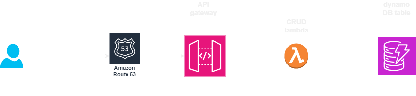

### What are we building here:
very basic but complete reference implementation of CRUD app using : 
- AWS API gateway
- AWS lambda
- DynamoDB,
- [terraform](https://www.terraform.io/ )
- [localstack](https://www.localstack.cloud/)

## ok, but how does it look?



### How can I deploy and run it ?

#### deploy locally:

- run localstack container via docker compose

```
docker compose up
```
- then manage terraform (also referenced as a service defined in the same docker-compose file) as follows:

```
docker compose -f  docker-compose.yml run --rm terraform-container init

docker compose -f  docker-compose.yml run --rm terraform-container fmt

docker compose -f  docker-compose.yml run --rm terraform-container validate

docker compose -f  docker-compose.yml run --rm terraform-container plan -var-file terraform.tfvars 

docker compose -f  docker-compose.yml run --rm terraform-container apply -var-file terraform.tfvars -auto-approve 

```
- API should be available via http://[api-gateway-generated-by_terraform]/product, the value of [api-gateway-generated-by_terraform] is provided as output from terraform module api_gateway

#### deploy to real AWS environment:
 - update .env file to include real values (vs those included by default, targeted at localstack based deployment)
 - no need to stand up docker compose stack
 - just use terraform commands described above (first init, then apply)
 - use url generated for API to access product API
